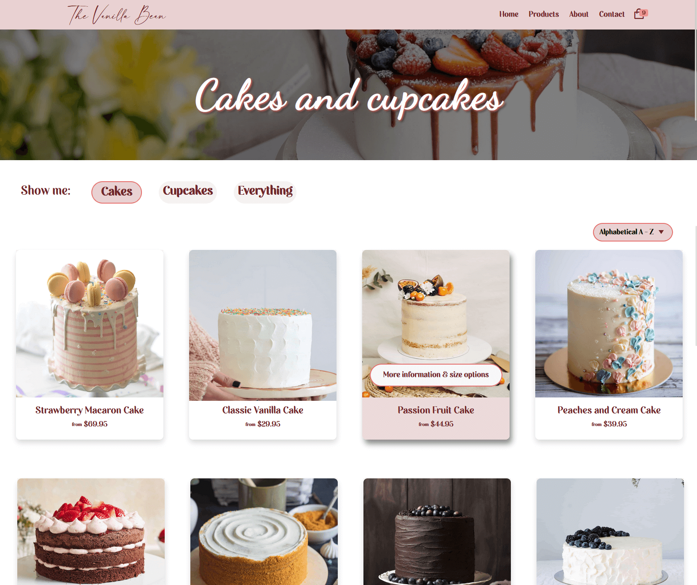
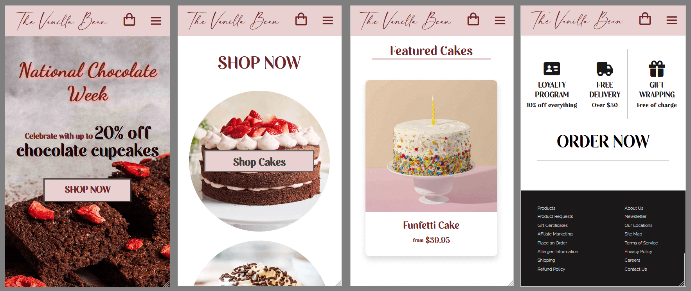
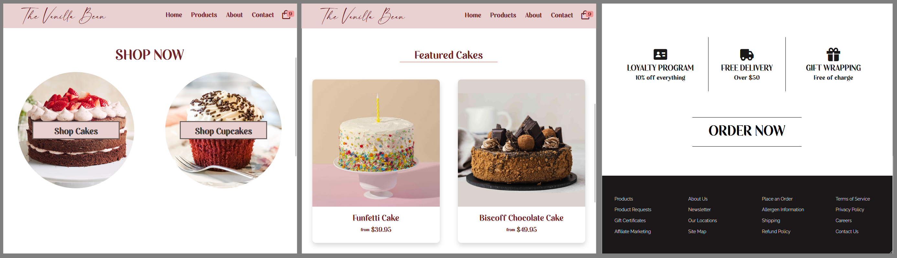
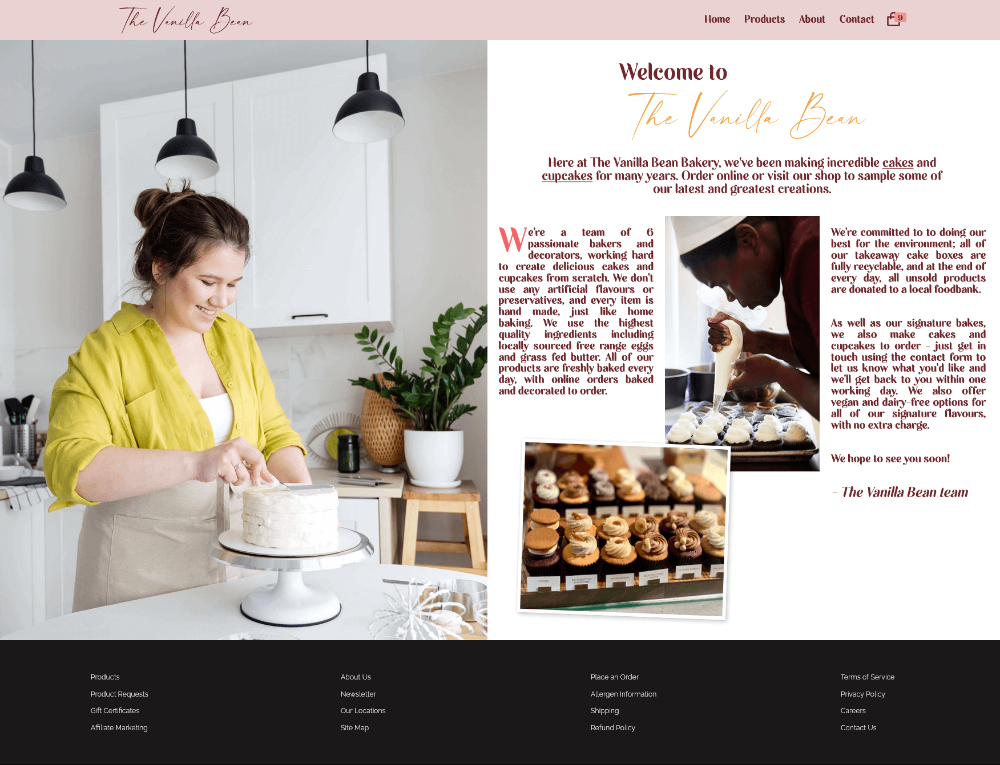
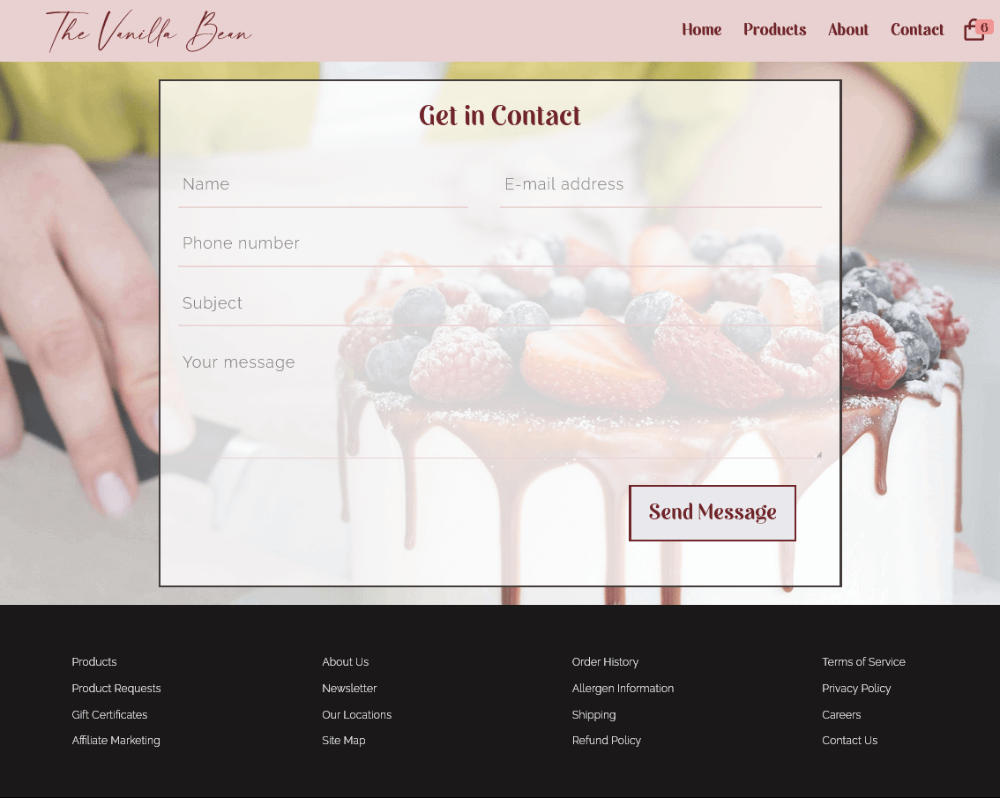
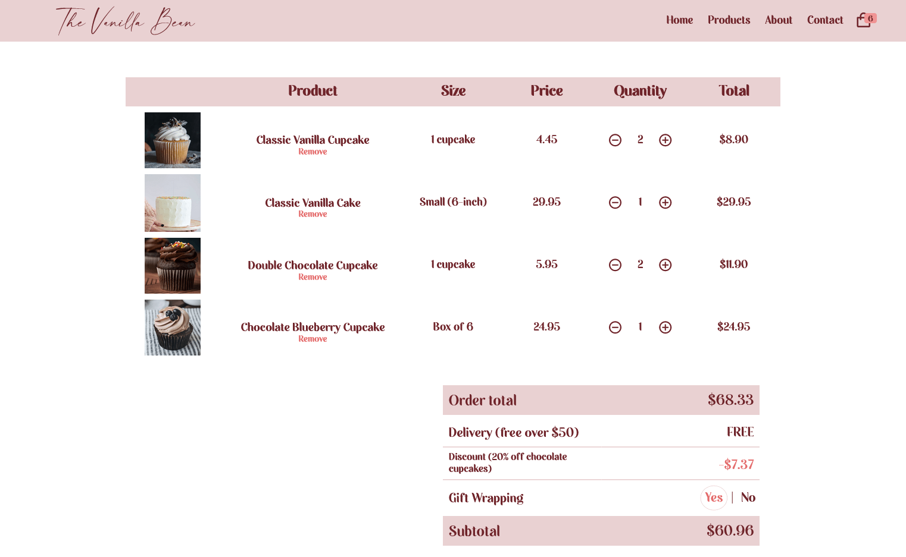

# The Vanilla Bean Bakery

<!-- TABLE OF CONTENTS -->
  
<h2 style="display: inline-block">Table of Contents</h2>

  

  <ol>
    <li>
      <a href="#about-the-project">About The Project</a>
      <ul>
        <li><a href="#built-with">Built With</a></li>
      </ul>
    </li>
    <li><a href="#demo--screenshots">Demo & Screenshots</a></li>
    <li><a href="#contributing">Contributing</a></li>
    <li><a href="#license">License</a></li>
  </ol>

 

<!-- ABOUT THE PROJECT -->
## About The Project

The Vanilla Bean Bakery is a multi page e-commerce website using the [Contentful](https://www.contentful.com/) content management system to store and display items. 
Products can be sorted by price (low to high and high to low), alphabetically (A-Z and Z-A), or by recommended. Each product can be bought in a variety of sizes, each size existing 
as its own basket item, and the basket also automatically applies discounts based on the current sale 
promoted on the homepage.

## Live version [here](https://vanilla-bean-bakery.pages.dev/).
 

### Built With

* HTML5
* CSS
* JavaScript
* [Contentful](https://www.contentful.com/) - Contentful is the API-first content management platform to create, manage and publish content on any digital channel
 

## Demo & Screenshots

  

  
The Vanilla Bean Bakery website is fully responsive so can be viewed from any screen size :  

  
     
  
     
  
     
  
     
  
    

  

<!-- CONTRIBUTING -->
## Contributing

If you find a bug, please open an issue [here](https://github.com/AmyMaule/vanilla-bean-bakery/issues/new), including as much information as you can. 
 
<!-- LICENSE -->
## License

MIT © [Amy Maule](https://github.com/AmyMaule)
